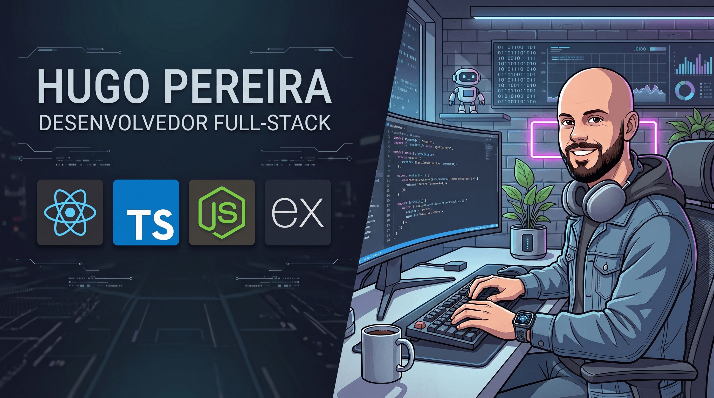

## 💻 Hugo Pereira

  

---

## 🧑🏻‍🦲 Sobre Mim

Olá 👋🏻, sou Hugo Pereira, tenho 34 anos e sou do interior do estado do Rio de Janeiro. Atualmente, estou em transição de carreira para a área de tecnologia.

Sou apaixonado por tecnologia, especialmente pelo desenvolvimento de aplicações. Comecei minha jornada estudando Front-end, aprofundando meus conhecimentos em tecnologias como React, TypeScript e Tailwind CSS.

Recentemente, iniciei meus estudos em Back-end com Node.js e, atualmente, estou me aprofundando no framework Express. Como próximo passo, pretendo revisar conceitos de bancos de dados e avançar na integração entre o Back-end e o banco de dados.

Meu objetivo é continuar evoluindo como desenvolvedor, ampliando meus conhecimentos tanto em Front-end quanto em Back-end e, assim, construir uma base sólida para atuar como profissional Full Stack.

* 🌱 Atualmente no 5º período de Ciência da Computação e estudando Back-end com Node.js
* 📫 Conecte-se comigo pelo [LinkedIn](https://www.linkedin.com/in/hugopereiradev/)
* 💬 Fique à vontade para falar comigo sobre tecnologia, desenvolvimento e minha jornada como dev

---

## 🛠️ Linguagens e Tecnologias

---

  
## 🌐 Conecte-se Comigo

